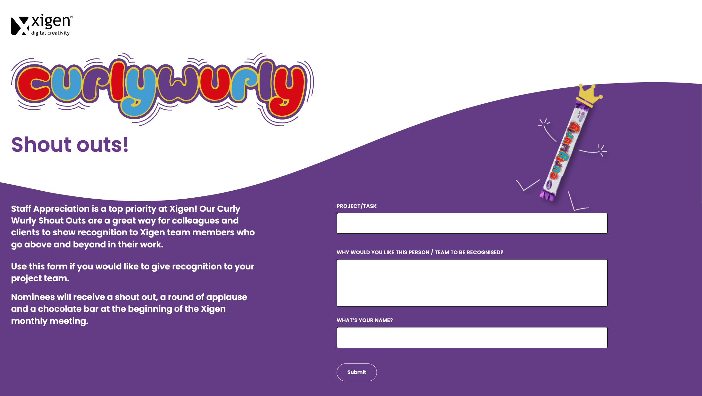

# curly-wurly-shoutouts

## Table of Contents
1.  [**Project Goals**](#project-goals)
    - [**Design choices**](#design-choices)

2. [**Technologies used**](#technologies-used)

3. [**Testing**](#testing)

### Project Goals

To create a Page for Xigen, this is a Curly Wurly shoutout, for internal and external people to nominate fellow employees for their work. This page allows you to select an employee, write a brief message as to why you are nominating this person and lastly your name. I worked with the backend team for the submission of the form via PHP. 

### Design Choices

XD Links can be found here:
<a href="https://appreciation.xigen.co.uk/staff" target="_blank">Internal</a>
<a href="https://appreciation.xigen.co.uk/external" target="_blank">External</a>

### Screenshot of the page (This page is no longer live)
- Here are the screenshots: 
    

     
    

## Technologies and Code Used

- This project uses HTML, TailwindCSS, PHP programming languages.

- [Visual Studio Code](https://code.visualstudio.com/) 
    - Developer used **Visual Studio Code** to create the Landing page. 
- [XD Link](https://helpx.adobe.com/xd/help/share-designs-prototypes.html)
    - All of my images used in the Landing page came from the XD Link
- [TailwindCSS](https://tailwindcss.com/)
    - The styling is done via TailwindCSS  
- [PHP](PHP)
    - For the form section

## Testing 

Testing information can be found in separate [testing.md](testing.md) file as well as [BrowserStack](https://www.browserstack.com). 

## Credits

### Content

- All text in this project was written by the developer.

#### Disclaimer

Thank you for taking your time to read this. 

Afra. 
